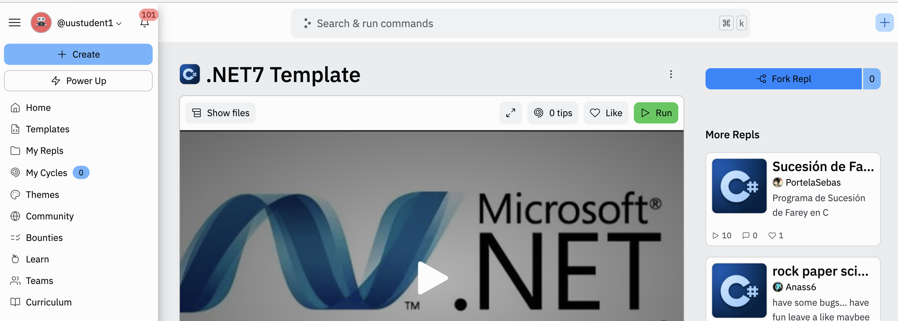

# .NET7 Template

This project should be used as a template to create any .NET7 projects (e.g. console, mvc etc).

## Fork Project
In example below, a student has used the following 
[link to the project](https://replit.com/@AMcC/NET7-Template ".NET7 template")
to view the template below. 


To create a copy of the template, click the Fork Repl button and give the copy an appropriate name.

## Creating a Project
Once the template has been forked you can open the repl then open a command shell window.
From the shell you can then create a .NET project in this empty repl.

```bash
$ dotnet new <project-type> -o <project-name>
```

Replace project type with e.g. ```console``` for console applications or ```mvc``` for web mvc projects. 

The ```-o <project-name>``` parameter requests the project be created in the named directory. You can if you wish use ```.``` for the 
project name and this will create the project in the current directory.

Examples below demonstrate creating a mvc web project in a named folder (mvc-1) and in second in the current directory. In second example
the project name will be same as the name of the cloned repl.

```bash
$ dotnet new mvc -o mvc1

$ dotnet new mvc -o .
```
